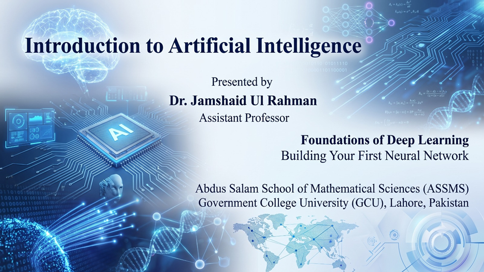

ASSMS short course on Artificial Intelligence, Python for AI, Deep Learning foundations, Neural Networks, Computer Vision, and hands-on implementation using Jupyter Notebooks and Google Colab.
# 🤖 ASSMS AI Deep Learning Short Course 2026

  

  

